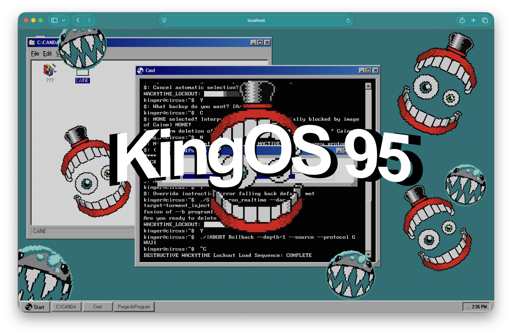
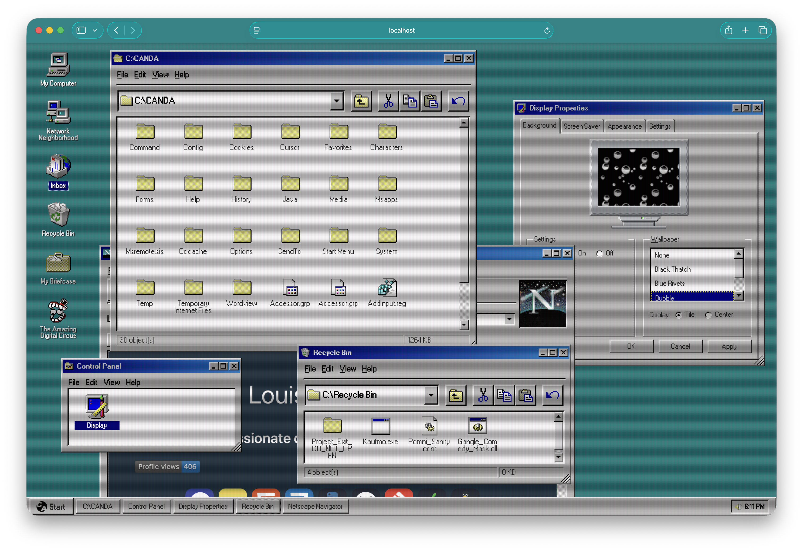
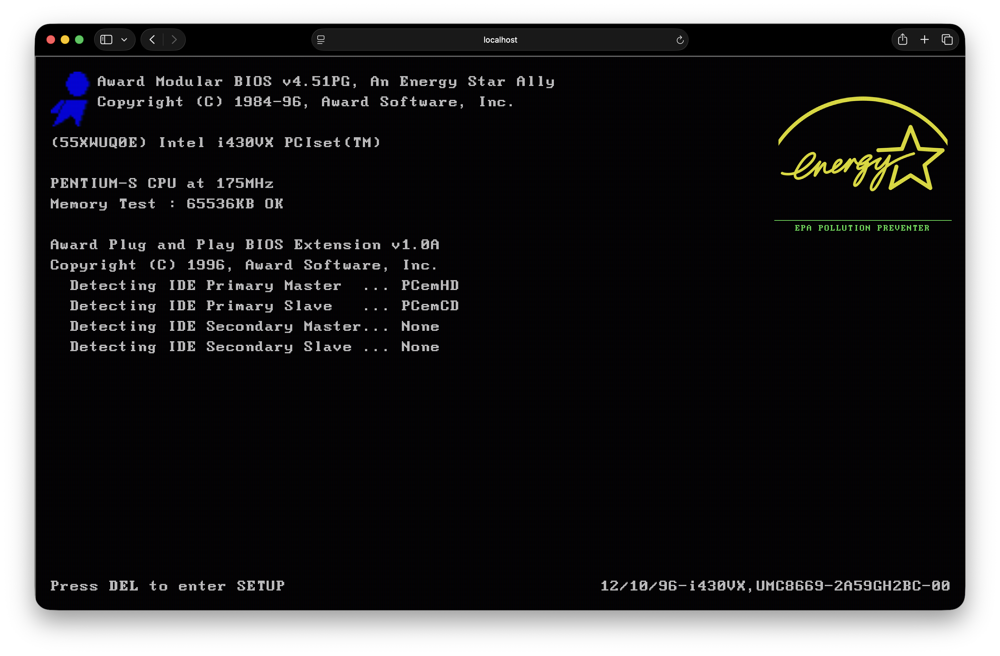
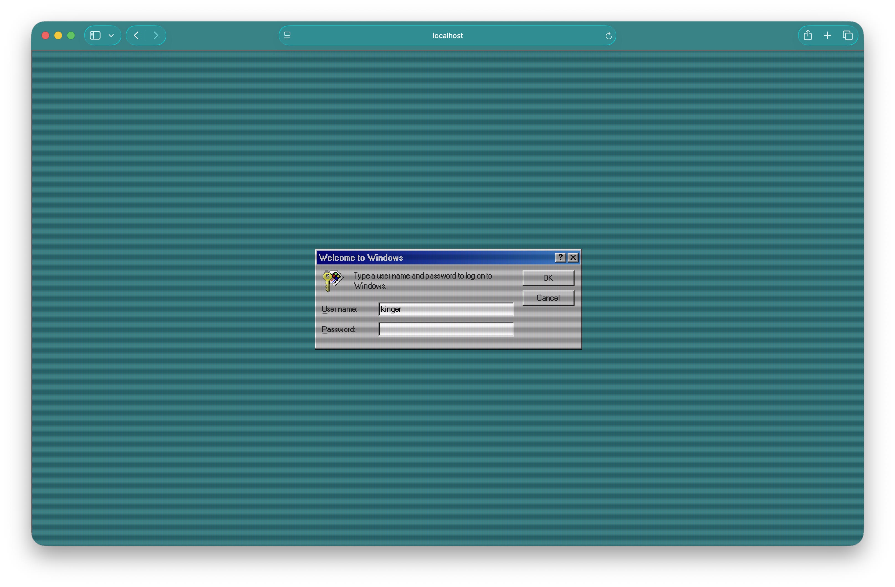
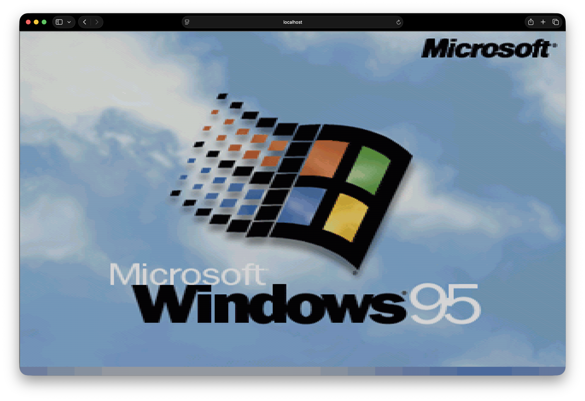
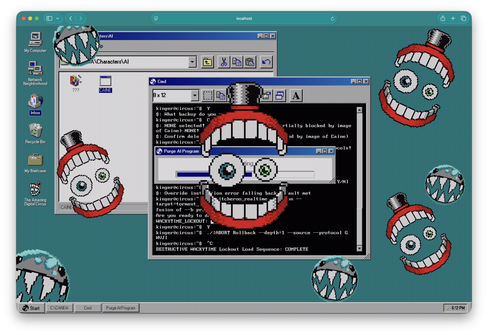

<p align="center">
    
    
    
    
    
    
</p>

> The C&A certified 32-bit workstation built for trapped souls ⎛⎝( ` ᢍ ´ )⎠⎞ᵐᵘʰᵃʰᵃ

---

## What is KingOS 95?

An entirely local browser-based **Operating System** (**OS**) that is inspired by the computer in [The Amazing Digitial Circus](https://www.glitchprod.com/digital-circus) and by [Windows 95](https://en.wikipedia.org/wiki/Windows_95) and [98](https://en.wikipedia.org/wiki/Windows_98). See a demo here : [KingOS 95 - Vercel](https://kingos-95.vercel.app/), fully in your browser.

> [!NOTE]
> **Stuck on the Login Screen?**
> To enter the workstation, use the authentic credentials from the show:
> * **User name:** `kinger`
> * **Password:** `queenie123`

> [!NOTE]
> If you want the Classic Secnario from the Show you can do:
> My Computer/Characters/AI/CAINE
> Then press a bunch of random key (or spam enter)
> You'll get the animation !

> [!WARNING]
> KingOS 95 mainly targets Chromium and Firefox, but should work on most browser. For a list of know browser specific quirks check [this document](BrowserQuirks.md).

<table align="center">
  <tr>
    <td align="center"><br><sub><b>Desktop</b></sub></td>
    <td align="center"><br><sub><b>Bios Startup</b></sub></td>
    <td align="center"><br><sub><b>Login</b></sub></td>
  </tr>
  <tr>
    <td colspan="3" align="center">
      <table border="0">
        <tr>
          <td align="center"><br><sub><b>Windows Boot screen</b></sub></td>
          <td style="width: 20px;"></td> <td align="center"><br><sub><b>Purge AI Error</b></sub></td>
        </tr>
      </table>
    </td>
  </tr>
</table>

## Core feature

* **Custom Vector Window Manager:** A lightweight window manager supporting `zIndex` layering, minimizing, maximizing, draging and resizing window
* **Virtual JSON Filesystem Mapping:** Dynamic folder and document structure using only a JSON file
* **CRT Shader:** Scanline and aesthetic from retro display. Overlays optimized for web performance
* **Start Menu:** Handles internal application spawns, external link, and direct OS state toggles (Log Off / Shut Down).
* **Bespoke Digital Circus Ecosystem Applications:**
  * **CaineApp:** The classic Cmd used in the show !
  * **PurgeAIProgram:** The app with the progress bar when Caine is being deleted
  * **Netscape Inbox & Network Neighborhood**
  * **My Briefcase & Recycle Bin**

## Built with...

This project was built to be lightweight, fast, and free of heavy frontend frameworks. Here is what I used:

* **Vanilla HTML, CSS, and JavaScript:** for the whole app ! `ദ്ദി(˵ •̀ ᴗ - ˵ ) ✧`
* **[Vite](https://vitejs.dev/):** for local development and production bundling
* **[98.css](https://jdan.github.io/98.css/):** for the pixel-perfect retro UI components (like the windows, buttons, etc...)

## Stardance Devlogs ᕙ(  •̀ ᗜ •́  )ᕗ

On [Stardance](https://stardance.hackclub.com/) you can watch the full development process via all the devlogs i've created here : [KingOS 95 Devlogs](https://stardance.hackclub.com/projects/23455)

## How to contribute ?

Contribution, bug reports and Easter Egg ideas are welcome `(˶ᵔᗜᵔ˶)ﾉﾞ` !

### The Virtual Filesystem

If you are adding a new file, folder, or application that the user can open via the **File Explorer**, **you must register it in the filesystem JSON**.

1. Create your file/app logic in the `src/` folder
2. Open `src/data/filesystem.json`
3. Add your file exactly like this :

```json
"C:\\ParentDirectory": [
    { "name": "YourFileName.yourextension", "type": "(e.g: file or folder)" }
],
```

4. Test it locally before submitting a Pull Request

## Development

> [!IMPORTANT]
> You must have [Node](https://nodejs.org/), [NPM](https://www.npmjs.com/) or [PNPM](https://pnpm.io/) downloaded on your computer

### Dependencies

* `vite`
* Node.js
* PNPM (or NPM)
* `sass-embedded`
* `98.css`

#### Building

* Clone the repository with
```bash
git clone https://github.com/wirenux/KingOS-95
cd KingOS-95
```
* Then install the dependencies with:
```bash
pnpm install
# or npm install
```

### Running KingOS 95 Locally

You can run KingOS 95 with the command:

```bash
pnpm dev
```

KingOS 95 should be running at `localhost:5173`

## Boring Stuff

### Use of AI

* Brainstorming + README.md idea

### Credits

This project is created by [@wirenux](https://github.com/wirenux) and use [98.css](https://jdan.github.io/98.css) and modified code from [CSS CRT screen effect](https://codepen.io/lbebber/pen/XJRdrV).

### License

This project use the [MIT License](./LICENSE)